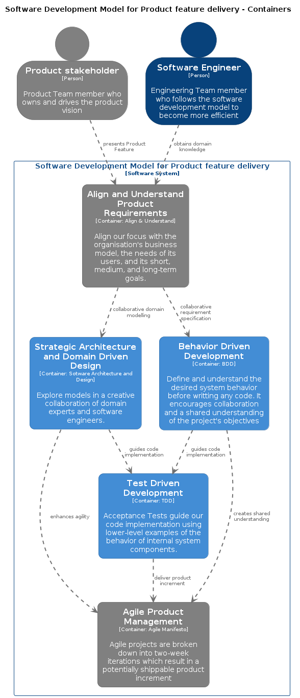

# Welcome to Gauzeder
{: .fs-9 }

Your new go-to marketplace for buying and selling items online, powered by a sleek and intuitive interface.
{: .fs-6 .fw-300 }

Gauzeder lets you discover products the fun way—with a simple swipe. Whether you're looking to declutter and sell your
items or hunting for great deals, we've designed Gauzeder to make the experience seamless and enjoyable.

- **Swipe to Shop:** Explore listings by swiping right on items you love and left to skip. Finding what you need has
  never been this easy.
- **Sell in Seconds:** Listing your items is a breeze! Snap a photo, set your price, and your product is ready for a
  buyer.
- **Smart Matches:** We bring the best offers to your fingertips, personalizing your feed based on your preferences.

Join Gauzeder today and start trading with ease!

[Get started now](#getting-started){: .btn .btn-primary .fs-5 .mb-4 .mb-md-0 .mr-2 }

---

{: .note }
This project serves as a practical guide for building scalable, maintainable, and domain-focused applications using the [Agile Software Development Model for Product feature delivery](https://ibanfr.github.io/agile-development-model).

